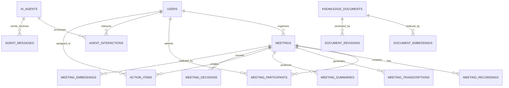

# 🗄️ Mapeamento Completo do Banco de Dados Supabase - Sistema X_AURA/AURALIS

## 📋 Visão Geral

Este documento apresenta o mapeamento completo e detalhado de todas as tabelas, colunas e relacionamentos necessários para o funcionamento do sistema AURALIS no Supabase. O esquema foi projetado considerando todos os recursos do sistema multi-agente, interface gráfica, e funcionalidades avançadas de IA.

## 🎯 Objetivos do Design

- **Escalabilidade**: Suportar milhares de usuários e reuniões
- **Performance**: Índices otimizados para consultas frequentes
- **Segurança**: Row Level Security (RLS) para isolamento de dados
- **Flexibilidade**: Campos JSONB para metadados extensíveis
- **Busca Semântica**: Integração com pgvector para embeddings

## 📊 Diagrama de Entidades Principais



## 🗂️ Estrutura Detalhada das Tabelas

### 1. 👥 **Gestão de Usuários**

#### 1.1 `users` - Usuários do Sistema
Estende a tabela `auth.users` do Supabase com informações adicionais.

| Coluna | Tipo | Restrições | Descrição |
|--------|------|------------|-----------|
| id | UUID | PK, FK→auth.users | ID único do usuário |
| username | TEXT | UNIQUE, NOT NULL | Nome de usuário único |
| full_name | TEXT | - | Nome completo |
| area | TEXT | DEFAULT 'geral' | Área/departamento |
| role | TEXT | CHECK IN ('user','admin','manager') | Papel no sistema |
| avatar_url | TEXT | - | URL do avatar |
| preferences | JSONB | DEFAULT '{}' | Preferências personalizadas |
| created_at | TIMESTAMPTZ | DEFAULT NOW() | Data de criação |
| updated_at | TIMESTAMPTZ | DEFAULT NOW() | Última atualização |
| last_login | TIMESTAMPTZ | - | Último login |
| is_active | BOOLEAN | DEFAULT TRUE | Status ativo |

#### 1.2 `user_sessions` - Sessões de Usuário
Rastreia sessões ativas e histórico de acesso.

| Coluna | Tipo | Restrições | Descrição |
|--------|------|------------|-----------|
| id | UUID | PK | ID da sessão |
| user_id | UUID | FK→users | Usuário da sessão |
| session_token | TEXT | UNIQUE | Token único da sessão |
| ip_address | INET | - | IP de acesso |
| user_agent | TEXT | - | Navegador/dispositivo |
| started_at | TIMESTAMPTZ | DEFAULT NOW() | Início da sessão |
| ended_at | TIMESTAMPTZ | - | Fim da sessão |
| is_active | BOOLEAN | DEFAULT TRUE | Sessão ativa |

### 2. 📹 **Reuniões e Gravações**

#### 2.1 `meetings` - Reuniões
Tabela central para todas as reuniões do sistema.

| Coluna | Tipo | Restrições | Descrição |
|--------|------|------------|-----------|
| id | UUID | PK | ID da reunião |
| title | TEXT | NOT NULL | Título da reunião |
| description | TEXT | - | Descrição/observações |
| organizer_id | UUID | FK→users | Organizador |
| status | TEXT | CHECK IN (...) | Status atual |
| scheduled_start | TIMESTAMPTZ | - | Início agendado |
| actual_start | TIMESTAMPTZ | - | Início real |
| actual_end | TIMESTAMPTZ | - | Fim real |
| duration_seconds | INTEGER | - | Duração em segundos |
| recording_url | TEXT | - | URL da gravação |
| transcription_status | TEXT | CHECK IN (...) | Status da transcrição |
| meeting_type | TEXT | CHECK IN (...) | Tipo de reunião |
| tags | TEXT[] | - | Tags/categorias |
| metadata | JSONB | DEFAULT '{}' | Metadados extras |

**Status possíveis**: 'scheduled', 'recording', 'paused', 'completed', 'cancelled', 'processing'

#### 2.2 `meeting_participants` - Participantes
Registra todos os participantes de cada reunião.

| Coluna | Tipo | Restrições | Descrição |
|--------|------|------------|-----------|
| id | UUID | PK | ID do registro |
| meeting_id | UUID | FK→meetings | Reunião |
| user_id | UUID | FK→users | Usuário (se interno) |
| participant_name | TEXT | NOT NULL | Nome do participante |
| role | TEXT | CHECK IN (...) | Papel na reunião |
| joined_at | TIMESTAMPTZ | - | Hora de entrada |
| left_at | TIMESTAMPTZ | - | Hora de saída |
| attendance_duration_seconds | INTEGER | - | Tempo presente |
| is_external | BOOLEAN | DEFAULT FALSE | Participante externo |

### 3. 📝 **Transcrições e Análises**

#### 3.1 `meeting_transcriptions` - Transcrições Completas
Armazena a transcrição completa de cada reunião.

| Coluna | Tipo | Restrições | Descrição |
|--------|------|------------|-----------|
| id | UUID | PK | ID da transcrição |
| meeting_id | UUID | FK→meetings | Reunião relacionada |
| full_text | TEXT | NOT NULL | Texto completo |
| language | TEXT | DEFAULT 'pt-BR' | Idioma |
| confidence_score | DECIMAL(3,2) | - | Score de confiança |
| word_count | INTEGER | - | Contagem de palavras |
| processing_time_ms | INTEGER | - | Tempo de processamento |

#### 3.2 `transcription_segments` - Segmentos de Fala
Divide a transcrição por falante e momento.

| Coluna | Tipo | Restrições | Descrição |
|--------|------|------------|-----------|
| id | UUID | PK | ID do segmento |
| transcription_id | UUID | FK→transcriptions | Transcrição pai |
| meeting_id | UUID | FK→meetings | Reunião |
| segment_index | INTEGER | NOT NULL | Ordem do segmento |
| speaker_name | TEXT | - | Nome do falante |
| speaker_id | UUID | FK→users | ID se usuário interno |
| text | TEXT | NOT NULL | Texto falado |
| start_time_seconds | DECIMAL(10,3) | - | Tempo inicial |
| end_time_seconds | DECIMAL(10,3) | - | Tempo final |
| confidence_score | DECIMAL(3,2) | - | Confiança |
| sentiment | TEXT | CHECK IN (...) | Sentimento detectado |
| key_points | TEXT[] | - | Pontos-chave extraídos |

#### 3.3 `action_items` - Itens de Ação
Tarefas e ações identificadas nas reuniões.

| Coluna | Tipo | Restrições | Descrição |
|--------|------|------------|-----------|
| id | UUID | PK | ID da ação |
| meeting_id | UUID | FK→meetings | Reunião origem |
| assigned_to | UUID | FK→users | Responsável |
| assigned_to_name | TEXT | - | Nome do responsável |
| description | TEXT | NOT NULL | Descrição da ação |
| due_date | DATE | - | Prazo |
| priority | TEXT | CHECK IN (...) | Prioridade |
| status | TEXT | CHECK IN (...) | Status atual |
| completed_at | TIMESTAMPTZ | - | Data de conclusão |

### 4. 🤖 **Sistema de Agentes IA**

#### 4.1 `ai_agents` - Definições dos Agentes
Configuração de cada agente do sistema.

| Coluna | Tipo | Restrições | Descrição |
|--------|------|------------|-----------|
| id | UUID | PK | ID do agente |
| name | TEXT | UNIQUE, NOT NULL | Nome único |
| type | TEXT | CHECK IN (...) | Tipo do agente |
| description | TEXT | - | Descrição |
| system_prompt | TEXT | - | Prompt do sistema |
| model | TEXT | DEFAULT 'gpt-3.5-turbo' | Modelo LLM |
| temperature | DECIMAL(2,1) | DEFAULT 0.7 | Temperatura |
| max_tokens | INTEGER | DEFAULT 1000 | Tokens máximos |
| is_active | BOOLEAN | DEFAULT TRUE | Agente ativo |

**Tipos**: 'orchestrator', 'query', 'brainstorm', 'optimizer', 'context'

#### 4.2 `agent_interactions` - Interações com Agentes
Log de todas as interações usuário-agente.

| Coluna | Tipo | Restrições | Descrição |
|--------|------|------------|-----------|
| id | UUID | PK | ID da interação |
| user_id | UUID | FK→users | Usuário |
| agent_id | UUID | FK→ai_agents | Agente |
| meeting_id | UUID | FK→meetings | Reunião relacionada |
| interaction_type | TEXT | CHECK IN (...) | Tipo de interação |
| input_text | TEXT | NOT NULL | Entrada do usuário |
| output_text | TEXT | - | Resposta do agente |
| context | JSONB | DEFAULT '{}' | Contexto |
| tokens_used | INTEGER | - | Tokens consumidos |
| response_time_ms | INTEGER | - | Tempo de resposta |
| satisfaction_rating | INTEGER | CHECK 1-5 | Avaliação |

#### 4.3 `agent_messages` - Comunicação Inter-Agentes
Mensagens trocadas entre agentes.

| Coluna | Tipo | Restrições | Descrição |
|--------|------|------------|-----------|
| id | UUID | PK | ID da mensagem |
| message_type | TEXT | CHECK IN (...) | Tipo de mensagem |
| sender_agent_id | UUID | FK→ai_agents | Remetente |
| recipient_agent_id | UUID | FK→ai_agents | Destinatário |
| content | JSONB | NOT NULL | Conteúdo |
| context | JSONB | DEFAULT '{}' | Contexto compartilhado |
| status | TEXT | CHECK IN (...) | Status |
| priority | INTEGER | CHECK 1-10 | Prioridade |
| created_at | TIMESTAMPTZ | DEFAULT NOW() | Criação |
| processed_at | TIMESTAMPTZ | - | Processamento |
| response_id | UUID | FK→agent_messages | Resposta relacionada |

### 5. 📚 **Base de Conhecimento**

#### 5.1 `knowledge_documents` - Documentos
Armazena documentos da base de conhecimento.

| Coluna | Tipo | Restrições | Descrição |
|--------|------|------------|-----------|
| id | UUID | PK | ID do documento |
| title | TEXT | NOT NULL | Título |
| content | TEXT | NOT NULL | Conteúdo |
| document_type | TEXT | CHECK IN (...) | Tipo |
| source_type | TEXT | CHECK IN (...) | Origem |
| source_meeting_id | UUID | FK→meetings | Reunião origem |
| author_id | UUID | FK→users | Autor |
| version | INTEGER | DEFAULT 1 | Versão |
| tags | TEXT[] | - | Tags |
| is_published | BOOLEAN | DEFAULT TRUE | Publicado |

### 6. 🔍 **Busca Vetorial (Embeddings)**

#### 6.1 `meeting_embeddings` - Embeddings de Reuniões
Vetores para busca semântica em reuniões.

| Coluna | Tipo | Restrições | Descrição |
|--------|------|------------|-----------|
| id | UUID | PK | ID do embedding |
| meeting_id | UUID | FK→meetings | Reunião |
| chunk_index | INTEGER | NOT NULL | Índice do chunk |
| chunk_text | TEXT | NOT NULL | Texto do chunk |
| embedding | vector(1536) | - | Vetor de embedding |
| metadata | JSONB | DEFAULT '{}' | Metadados |

#### 6.2 `document_embeddings` - Embeddings de Documentos
Vetores para busca semântica em documentos.

| Coluna | Tipo | Restrições | Descrição |
|--------|------|------------|-----------|
| id | UUID | PK | ID do embedding |
| document_id | UUID | FK→documents | Documento |
| chunk_index | INTEGER | NOT NULL | Índice do chunk |
| chunk_text | TEXT | NOT NULL | Texto do chunk |
| embedding | vector(1536) | - | Vetor de embedding |
| metadata | JSONB | DEFAULT '{}' | Metadados |

### 7. ⚡ **Cache e Otimização**

#### 7.1 `query_cache` - Cache de Consultas
Cache inteligente para consultas frequentes.

| Coluna | Tipo | Restrições | Descrição |
|--------|------|------------|-----------|
| id | UUID | PK | ID do cache |
| cache_key | TEXT | UNIQUE, NOT NULL | Chave única |
| query_text | TEXT | NOT NULL | Consulta original |
| result | JSONB | NOT NULL | Resultado cacheado |
| agent_id | UUID | FK→ai_agents | Agente relacionado |
| hit_count | INTEGER | DEFAULT 0 | Hits do cache |
| ttl_seconds | INTEGER | DEFAULT 3600 | TTL em segundos |
| created_at | TIMESTAMPTZ | DEFAULT NOW() | Criação |
| expires_at | TIMESTAMPTZ | - | Expiração |
| last_accessed | TIMESTAMPTZ | DEFAULT NOW() | Último acesso |

#### 7.2 `token_usage` - Uso de Tokens
Rastreamento de consumo de tokens da API.

| Coluna | Tipo | Restrições | Descrição |
|--------|------|------------|-----------|
| id | UUID | PK | ID do registro |
| user_id | UUID | FK→users | Usuário |
| agent_id | UUID | FK→ai_agents | Agente |
| interaction_id | UUID | FK→interactions | Interação |
| tokens_input | INTEGER | - | Tokens de entrada |
| tokens_output | INTEGER | - | Tokens de saída |
| tokens_total | INTEGER | - | Total de tokens |
| model | TEXT | - | Modelo usado |
| cost_estimate | DECIMAL(10,6) | - | Custo estimado |

### 8. 📊 **Estatísticas e Analytics**

#### 8.1 `user_statistics` - Estatísticas de Usuário
Métricas agregadas por usuário.

| Coluna | Tipo | Restrições | Descrição |
|--------|------|------------|-----------|
| user_id | UUID | PK, FK→users | Usuário |
| total_meetings_organized | INTEGER | DEFAULT 0 | Reuniões organizadas |
| total_meetings_attended | INTEGER | DEFAULT 0 | Reuniões participadas |
| total_recording_minutes | INTEGER | DEFAULT 0 | Minutos gravados |
| total_ai_interactions | INTEGER | DEFAULT 0 | Interações com IA |
| total_tokens_used | INTEGER | DEFAULT 0 | Tokens consumidos |
| last_activity | TIMESTAMPTZ | - | Última atividade |

#### 8.2 `agent_statistics` - Estatísticas de Agentes
Métricas de performance dos agentes.

| Coluna | Tipo | Restrições | Descrição |
|--------|------|------------|-----------|
| agent_id | UUID | PK, FK→ai_agents | Agente |
| total_interactions | INTEGER | DEFAULT 0 | Total de interações |
| average_response_time_ms | DECIMAL | - | Tempo médio resposta |
| success_rate | DECIMAL(5,2) | - | Taxa de sucesso |
| average_satisfaction | DECIMAL(3,2) | - | Satisfação média |
| total_tokens_used | INTEGER | DEFAULT 0 | Tokens totais |
| cache_hit_rate | DECIMAL(5,2) | - | Taxa de cache hit |
| error_count | INTEGER | DEFAULT 0 | Contagem de erros |

## 🔐 Políticas de Segurança (RLS)

### Políticas Implementadas:

1. **Usuários**
   - Podem ver e editar seu próprio perfil
   - Podem ver informações públicas de outros usuários

2. **Reuniões**
   - Usuários veem reuniões que organizaram
   - Usuários veem reuniões que participaram
   - Admins veem todas as reuniões

3. **Transcrições**
   - Acesso vinculado às permissões da reunião
   - Não permite edição após processamento

4. **Interações IA**
   - Completamente privadas por usuário
   - Admins podem ver estatísticas agregadas

5. **Base de Conhecimento**
   - Documentos públicos visíveis a todos autenticados
   - Documentos privados apenas para autores/editores

## 🚀 Índices de Performance

### Índices Críticos:

1. **Busca de Reuniões**
   ```sql
   idx_meetings_organizer
   idx_meetings_status
   idx_meetings_created_at
   ```

2. **Busca em Transcrições**
   ```sql
   idx_transcriptions_text_fts (Full-text search)
   idx_transcription_segments_speaker
   ```

3. **Busca Vetorial**
   ```sql
   idx_meeting_embeddings_vector (IVFFlat)
   idx_document_embeddings_vector (IVFFlat)
   ```

4. **Cache e Performance**
   ```sql
   idx_query_cache_key
   idx_query_cache_expires
   ```

## 📈 Funções e Triggers

### Funções Principais:

1. **update_updated_at_column()**
   - Atualiza automaticamente campo updated_at

2. **calculate_meeting_duration()**
   - Calcula duração da reunião automaticamente

3. **update_user_statistics()**
   - Atualiza estatísticas do usuário em tempo real

4. **search_meetings_semantic()**
   - Busca semântica usando embeddings

## 🔄 Fluxo de Dados

### 1. Gravação de Reunião:
```
GUI → meetings (criar) → meeting_recordings → 
transcription (processar) → segments → 
embeddings (gerar) → summaries/action_items
```

### 2. Interação com IA:
```
Usuário → agent_interactions → agent_messages → 
query_cache (verificar) → ai_agents (processar) → 
token_usage (registrar) → response
```

### 3. Busca Semântica:
```
Query → embedding (gerar) → search_embeddings_cache → 
meeting/document_embeddings (buscar) → 
resultados rankeados
```

## 🛠️ Scripts de Manutenção

### Limpeza de Cache Expirado:
```sql
DELETE FROM query_cache 
WHERE expires_at < NOW();
```

### Atualização de Estatísticas:
```sql
REFRESH MATERIALIZED VIEW CONCURRENTLY mv_user_statistics;
```

### Reindexação de Embeddings:
```sql
REINDEX INDEX CONCURRENTLY idx_meeting_embeddings_vector;
```

## 📝 Considerações de Implementação

1. **Particionamento**: Considerar particionar tabelas grandes por data (meetings, transcriptions)
2. **Arquivamento**: Implementar política de arquivamento para dados antigos
3. **Backup**: Configurar backups incrementais diários
4. **Monitoramento**: Implementar alertas para performance e espaço
5. **Escalabilidade**: Preparar sharding para crescimento futuro

## 🎯 Próximos Passos

1. Executar scripts de criação no Supabase
2. Configurar políticas RLS
3. Popular dados iniciais (agentes, configurações)
4. Testar performance com dados de exemplo
5. Implementar funções de manutenção
6. Configurar backups automáticos

---

Este mapeamento fornece uma base sólida e escalável para o sistema AURALIS, garantindo performance, segurança e flexibilidade para crescimento futuro.