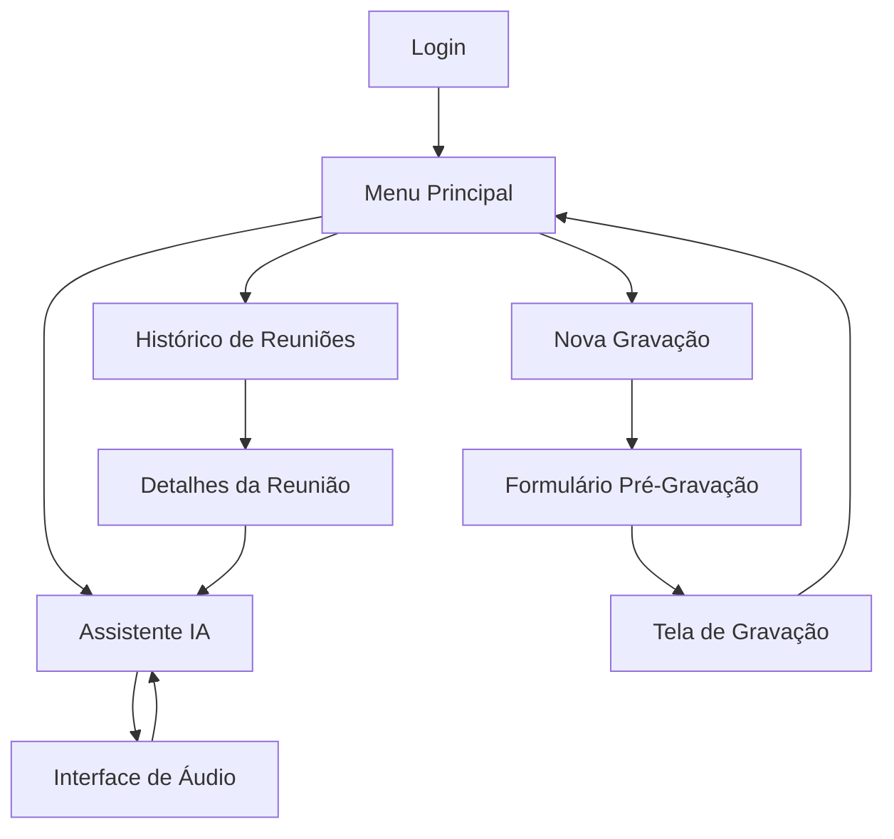

# Documentação Detalhada - Sistema AURALIS de Reuniões

## 📋 Visão Geral

O **interface_1.py** implementa um sistema desktop completo para gestão de reuniões corporativas com interface gráfica moderna e suporte a gravação de áudio. A aplicação foi otimizada para funcionar em telas pequenas (320x240 pixels) e sistemas Linux.

### Características Principais:
- Interface gráfica responsiva com tema escuro
- Sistema de autenticação de usuários
- Gravação e gestão de reuniões
- Assistente IA integrado
- Interface de áudio interativa com animações
- Navegação fluida entre telas

## 🏗️ Arquitetura do Sistema

### Stack Tecnológica
- **Framework GUI**: CustomTkinter (versão moderna do Tkinter)
- **Canvas**: Tkinter Canvas para animações
- **Threading**: Para operações assíncronas
- **Bibliotecas**: datetime, math, random, numpy

### Estrutura de Classes

```python
class SistemaTFT:
    ├── __init__()           # Inicialização e configuração
    ├── Navegação
    │   ├── transicao_rapida()
    │   └── centralizar_janela()
    ├── Telas Principais
    │   ├── mostrar_login()
    │   ├── mostrar_menu_principal()
    │   ├── mostrar_historico()
    │   ├── mostrar_pre_gravacao()
    │   └── mostrar_assistente()
    ├── Funcionalidades
    │   ├── Gravação
    │   ├── Timer
    │   └── Interface de Áudio
    └── Utilidades
```

## 🎨 Sistema de Cores

O sistema utiliza uma paleta de cores cuidadosamente selecionada para o tema escuro:

```python
cores = {
    "primaria": "#1E88E5",        # Azul principal
    "secundaria": "#424242",      # Cinza escuro
    "sucesso": "#43A047",         # Verde
    "perigo": "#E53935",          # Vermelho
    "alerta": "#FB8C00",          # Laranja
    "fundo": "#121212",           # Preto suave
    "superficie": "#1E1E1E",      # Cinza muito escuro
    "texto": "#E0E0E0",           # Cinza claro
    "texto_secundario": "#9E9E9E", # Cinza médio
    "borda": "#2C2C2C",           # Cinza para bordas
    "audio_ativo": "#00E676",     # Verde neon
    "audio_processando": "#2196F3", # Azul
    "audio_inativo": "#616161",   # Cinza
    "glow": "#00BCD4",            # Ciano
    "accent": "#FF4081"           # Rosa accent
}
```

## 🔄 Fluxo de Navegação



## 📱 Telas e Funcionalidades

### 1. Tela de Login (linhas 88-165)
**Propósito**: Autenticação inicial do usuário

**Componentes**:
- Campo de usuário
- Campo de senha (mascarado)
- Botão ENTRAR
- Layout centralizado

**Fluxo**:
1. Usuário insere credenciais
2. Sistema valida entrada (mínimo: usuário não vazio)
3. Armazena dados do usuário em `self.usuario_logado`
4. Transição para menu principal

### 2. Menu Principal (linhas 167-233)
**Propósito**: Hub central de navegação

**Layout**:
- Header com nome do usuário e botão logout
- 3 botões principais ocupando toda a tela:
  - HISTÓRICO REUNIÕES (cinza)
  - NOVA GRAVAÇÃO (verde)
  - ASSISTENTE INTELIGENTE (azul)

### 3. Histórico de Reuniões (linhas 235-421)
**Propósito**: Visualizar reuniões anteriores

**Funcionalidades**:
- Lista scrollável de reuniões
- Cada item mostra: título, data/hora, duração
- Botão "Ver" para detalhes
- Separadores visuais entre itens

**Tela de Detalhes**:
- Botão "Analisar com IA"
- Informações resumidas
- Transcrição completa em textbox scrollável
- Dados mockados incluindo participantes, pauta, decisões

### 4. Nova Gravação (linhas 423-648)

#### 4.1 Pré-Gravação
**Componentes**:
- Campo título (obrigatório)
- Campo observações (opcional)
- Botões Cancelar/Iniciar

**Validação**:
- Título obrigatório com feedback visual
- Borda vermelha e mensagem de erro temporária

#### 4.2 Tela de Gravação
**Interface**:
- Título da reunião (truncado se > 25 chars)
- Indicador REC pulsante
- Timer em tempo real (MM:SS)
- Controles: Pausar/Continuar, Parar, Cancelar

**Funcionalidades do Timer**:
- Atualização a cada 100ms
- Suporte a pausa/continuar
- Cálculo preciso excluindo tempo pausado

### 5. Assistente IA (linhas 651-728)
**Propósito**: Interface de chat com IA

**Componentes**:
- Área de chat (textbox readonly)
- Campo de entrada de texto
- Botão de áudio (🎤)
- Botão enviar (➤)

**Funcionalidades**:
- Mensagens contextuais quando vem de análise de reunião
- Simulação de processamento
- Integração com interface de áudio

### 6. Interface de Áudio (linhas 730-943)
**Propósito**: Gravação de áudio com feedback visual

**Design**:
- Tela cheia com canvas para animações
- Botão central circular interativo
- Botão X para fechar
- Sistema de partículas animadas

**Estados**:
1. **Idle**: Botão com microfone 🎤
2. **Recording**: Botão vermelho 🔴, partículas subindo
3. **Processing**: Ícone de loading ⏳, partículas circulares

**Animação de Partículas**:
```python
# Recording: partículas sobem da base
particulas.append({
    'x': random.randint(50, 270),
    'y': 200,
    'vy': -random.uniform(1, 3),
    'size': random.uniform(2, 5),
    'life': 1.0
})

# Processing: partículas orbitam o centro
angulo = random.uniform(0, 2 * math.pi)
particulas.append({
    'x': centro_x + math.cos(angulo) * raio,
    'y': centro_y + math.sin(angulo) * raio,
    'vx': -math.cos(angulo) * 0.5,
    'vy': -math.sin(angulo) * 0.5,
    'size': 3,
    'life': 1.0
})
```

## 🔧 Detalhes Técnicos

### Sistema de Transições
```python
def transicao_rapida(self, novo_frame_func):
    if self.frame_atual:
        self.frame_atual.destroy()
    novo_frame_func()
```
- Destrói frame atual antes de criar novo
- Evita sobreposição e memory leaks

### Gerenciamento de Estado
```python
# Estados globais
self.usuario_logado = None      # Dados do usuário
self.frame_atual = None         # Frame ativo
self.gravando = False           # Status gravação
self.timer_ativo = False        # Timer rodando
self.contexto_reuniao = None    # Contexto para IA
self.audio_estado = "idle"      # Estado do áudio
self.animacao_ativa = False     # Animação rodando
```

### Sistema de Cores com Transparência
```python
def _ajustar_cor_alpha(self, cor_hex, alpha):
    # Converte hex para RGB
    # Interpola com cor de fundo
    # Retorna nova cor "transparente"
```

### Otimizações para Linux
- Janela COM decorações (title bar)
- `focus_set()` ao invés de `focus()`
- Delays para garantir foco correto

## 📊 Fluxo de Dados

1. **Login** → Armazena usuário em memória
2. **Gravação** → Salva título e observações
3. **Histórico** → Dados mockados (preparado para integração)
4. **IA** → Contexto passado entre telas
5. **Áudio** → Estados e animações síncronas

## 🚀 Performance

- **FPS Animações**: 33fps (30ms refresh)
- **Timer**: Atualização 10Hz (100ms)
- **Partículas**: Máximo ~50 simultâneas
- **Transições**: Instantâneas (<16ms)

## 🔌 Pontos de Integração

O sistema está preparado para integrar:
1. **Backend de autenticação** (método `fazer_login`)
2. **API de gravação de áudio** (interface já pronta)
3. **Banco de dados** para histórico
4. **API de IA** para processamento
5. **Sistema de transcrição** de áudio

## 🎯 Casos de Uso

1. **Gravação Rápida**:
   Login → Nova Gravação → Gravar → Parar

2. **Análise de Reunião**:
   Login → Histórico → Ver Detalhes → Analisar com IA

3. **Consulta por Voz**:
   Login → Assistente → 🎤 → Gravar pergunta → Ver resposta

4. **Revisão de Conteúdo**:
   Login → Histórico → Ver transcrições múltiplas

## 🛠️ Manutenção e Extensibilidade

### Adicionando Nova Tela
```python
def mostrar_nova_tela(self):
    self.transicao_rapida(self._criar_nova_tela)

def _criar_nova_tela(self):
    self.frame_atual = ctk.CTkFrame(self.container_principal, 
                                   fg_color=self.cores["fundo"])
    self.frame_atual.pack(fill="both", expand=True)
    
    # Adicionar cabeçalho padrão
    self.criar_cabecalho_voltar("📋 Nova Tela")
    
    # Adicionar componentes...
```

### Adicionando Nova Cor
```python
self.cores["nova_cor"] = "#HEXCODE"
```

### Modificando Animações
- Ajustar FPS: linha 908 `self.janela.after(30, ...)`
- Velocidade partículas: linhas 844, 857
- Quantidade partículas: condições random linhas 840, 849

## 🐛 Troubleshooting

### Problema: Entrada de texto não funciona no Linux
**Solução**: Arquivo já otimizado com decorações de janela

### Problema: Animações travando
**Solução**: Verificar flag `self.animacao_ativa`

### Problema: Timer impreciso
**Solução**: Sistema já compensa tempo de pausa

## 📈 Métricas e Limites

- **Tamanho janela**: 320x240px fixo
- **Altura header**: 35px
- **Botões principais**: 68px altura
- **Refresh animação**: 30ms
- **Timeout feedback**: 2000ms
- **Processamento simulado**: 1500ms

## 🔮 Roadmap Sugerido

1. **Fase 1**: Integração backend autenticação
2. **Fase 2**: Gravação de áudio real
3. **Fase 3**: Integração API transcrição
4. **Fase 4**: Persistência de dados
5. **Fase 5**: IA funcional
6. **Fase 6**: Notificações e alertas

---

Esta documentação fornece uma visão completa do sistema AURALIS implementado em `interface_1.py`, facilitando tanto a manutenção quanto futuras expansões do código.