# 🔄 FLUXOGRAMA DE ALTERAÇÕES - SISTEMA AURALIS

Este arquivo mantém o histórico visual de todas as alterações realizadas no projeto. Para detalhes analíticos completos, consulte os arquivos referenciados em READMES_COMP/.

## 📊 Legenda
- 🗑️ Exclusão
- ➕ Adição
- 📝 Modificação
- 🔧 Configuração
- 📚 Documentação
- 💾 Banco de Dados
- ✅ Validação/Teste

## 🌊 Fluxo Cronológico de Alterações

```mermaid
flowchart TD
    Start[Início da Sessão] --> A1

    A1[🗑️ Análise config_ia.py]
    A1 --> A1_1[Verificado: código órfão]
    A1_1 --> A1_2[Excluído arquivo]
    A1 --> README1[README_04_01_1630_001.md]

    A1_2 --> A2[📝 Atualização CLAUDE.md]
    A2 --> A2_1[Adicionada instrução READMEs obrigatórios]
    A2 --> README2[README_04_01_1635_002.md]

    A2_1 --> A3[📚 Análise FRONT.py]
    A3 --> A3_1[Mapeamento funcionalidades GUI]
    A3_1 --> A3_2[Identificação requisitos banco]
    A3 --> README3[README_04_01_1637_003.md]

    A3_2 --> A4[💾 Criação SQL Supabase v1]
    A4 --> A4_1[Erro: DROP POLICY]
    A4 --> README4[README_04_01_1640_004.md]

    A4_1 --> A5[💾 SQL Supabase v2 Corrigido]
    A5 --> A5_1[Erro: Sintaxe embeddings]
    A5 --> README5[README_04_01_1641_005.md]

    A5_1 --> A6[💾 SQL_SUPABASE_DEFINITIVO]
    A6 --> A6_1[✅ Executado com sucesso]
    A6_1 --> A6_2[4 tabelas criadas]
    A6 --> README6[README_04_01_1644_006.md]

    A6_2 --> A7[🗑️ Limpeza SQLs antigos]
    A7 --> A7_1[2 arquivos removidos]
    A7_1 --> A7_2[Git commit realizado]
    A7 --> README7[README_04_01_1730_007.md]

    A7_2 --> A8[➕ Scripts dados teste]
    A8 --> A8_1[Criada pasta dados_teste_supabase/]
    A8_1 --> A8_2[6 arquivos Python criados]
    A8_2 --> A8_3[Dados realistas simulados]
    A8 --> README8[README_04_01_1730_007.md]

    A8_3 --> A9[📚 Criação Sistema Fluxograma]
    A9 --> A9_1[FLUXOGRAMA.md criado]
    A9_1 --> A9_2[CLAUDE.md atualizado]
    A9_2 --> A9_3[Nova regra documentação]
    A9 --> README9[README_04_01_1735_008.md]
    
    A9_3 --> A10[📝 Aprimoramento Documentação]
    A10 --> A10_1[Análise contexto obrigatória]
    A10_1 --> A10_2[READMEs ultra-detalhados]
    A10_2 --> A10_3[Processo iterativo documentado]
    A10 --> README10[README_04_01_1740_009.md]
    
    A10_3 --> A11[🔧 Git Push Alterações]
    A11 --> A11_1[Commit estrutura READMEs]
    A11_1 --> A11_2[Push para GitHub]
    A11 --> README11[README_04_01_1647_010.md]
    
    A11_2 --> A12[💾 Execução Scripts Teste]
    A12 --> A12_1[✅ 9 usuários inseridos]
    A12_1 --> A12_2[✅ 4 reuniões inseridas]
    A12_2 --> A12_3[✅ 8 interações IA inseridas]
    A12_3 --> A12_4[✅ Validação completa]
    A12 --> README12[README_04_01_1653_011.md]
    
    A12_4 --> A13[🔧 Git Push Final]
    A13 --> A13_1[Commit documentação completa]
    A13_1 --> A13_2[Push para GitHub]
    A13 --> README13[README_04_01_1655_012.md]
    
    A13_2 --> A14[🔧 Refatoração Nomenclatura]
    A14 --> A14_1[16 READMEs renomeados]
    A14_1 --> A14_2[IDs sequenciais adicionados]
    A14_2 --> A14_3[Referências atualizadas]
    A14 --> README14[README_04_01_1745_013.md]
    
    A14_3 --> A15[🔧 Correção Ordem Cronológica]
    A15 --> A15_1[Validação contra FLUXOGRAMA]
    A15_1 --> A15_2[11 arquivos renumerados]
    A15_2 --> A15_3[Ordem real restaurada]
    A15 --> README15[README_04_01_1750_019.md]
    
    A15_3 --> A16[✅ Análise Knowledge Base]
    A16 --> A16_1[Verificado design intencional]
    A16_1 --> A16_2[Tabela vazia conforme esperado]
    A16_2 --> A16_3[Documentação confirma decisão]
    A16 --> README16[README_04_01_1659_014.md]
    
    A16_3 --> A17[🔧 Git Commit Checkpoint]
    A17 --> A17_1[22 arquivos commitados]
    A17_1 --> A17_2[Mensagem: bases supabase ok]
    A17_2 --> A17_3[Próxima fase: embeddings chunk]
    A17 --> README17[README_04_01_1725_020.md]
    
    A17_3 --> A18[🔍 Análise Credenciais Login]
    A18 --> A18_1[8 usuários identificados]
    A18_1 --> A18_2[Senha padrão: senha123]
    A18_2 --> A18_3[Mock mode ativo confirmado]
    A18 --> README18[README_06_01_1830_021.md]
    
    A18_3 --> A19[🔧 Correção IDs Duplicados]
    A19 --> A19_1[ID 014 duplicado identificado]
    A19_1 --> A19_2[Arquivo 16:59 renomeado para 022]
    A19_2 --> A19_3[Integridade sequencial restaurada]
    A19 --> README19[README_06_01_2130_023.md]
    
    A19_3 --> A20[🔄 Reversão de Alterações]
    A20 --> A20_1[__init__.py restaurado]
    A20_1 --> A20_2[main.py restaurado]
    A20_2 --> A20_3[Mocks removidos]
    A20 --> README20[README_06_01_2135_024.md]
    
    A20_3 --> A21[📝 Correção FLUXOGRAMA IDs]
    A21 --> A21_1[Gap 014-020 identificado]
    A21_1 --> A21_2[Referências corrigidas]
    A21_2 --> A21_3[Estratégia prevenção implementada]
    A21 --> README21[README_06_01_2132_025.md]
    
    A21_3 --> A22[🔍 Análise Profunda Agentes]
    A22 --> A22_1[Mapeamento variáveis/dados]
    A22_1 --> A22_2[Fluxo comunicação documentado]
    A22_2 --> A22_3[Integração BD/UI mapeada]
    A22 --> README22[README_04_01_1839_001.md]
    
    A22_3 --> A23[📊 Análise estrutura Supabase]
    A23 --> A23_1[Extração de tabelas e campos]
    A23_1 --> A23_2[Mapeamento de tipos de dados]
    A23_2 --> A23_3[Identificação de relacionamentos e funções]
    A23 --> README23[README_06_01_2215_026.md]
    
    A23_3 --> A24[🚀 Análise Automação Compact]
    A24 --> A24_1[Viabilidade técnica analisada]
    A24_1 --> A24_2[Limitações identificadas]
    A24_2 --> A24_3[Alternativas propostas]
    A24 --> README24[README_06_01_2250_027.md]
    
    A24_3 --> A25[🔍 Análise Integração Agentes-BD]
    A25 --> A25_1[Mocks identificados em cada agente]
    A25_1 --> A25_2[Pontos de integração mapeados]
    A25_2 --> A25_3[Checklist implementação criado]
    A25 --> README25[README_06_01_2255_028.md]
    
    A25_3 --> A26[📊 Mapeamento BD Supabase]
    A26 --> A26_1[4 tabelas principais mapeadas]
    A26_1 --> A26_2[15 índices e 4 funções SQL]
    A26_2 --> A26_3[Estrutura completa documentada]
    A26 --> README26[README_06_01_2310_029.md]
    
    A26_3 --> A27[🔄 Integração Completa DATABASE-AGENTES-INTERFACE]
    A27 --> A27_1[openai_mock.py removido]
    A27_1 --> A27_2[SupabaseHandler integrado aos agentes]
    A27_2 --> A27_3[main.py unificado criado]
    A27_3 --> A27_4[FRONT.py conectado ao backend]
    A27 --> README27[README_06_01_2338_029.md]
    
    A27_4 --> A28[🔧 Remoção Total de Mocks - APENAS Supabase]
    A28 --> A28_1[CLAUDE.md atualizado com proibição]
    A28_1 --> A28_2[agente_base_simulado.py deletado]
    A28_2 --> A28_3[main.py sem fallbacks]
    A28_3 --> A28_4[Sistema 100% dependente Supabase]
    A28 --> README28[README_07_01_0003_030.md]
    
    A28_4 --> Current[Estado Atual: Sistema APENAS com Supabase na nuvem]

    style Start fill:#90EE90
    style Current fill:#FFD700
    style README1 fill:#E6E6FA
    style README2 fill:#E6E6FA
    style README3 fill:#E6E6FA
    style README4 fill:#E6E6FA
    style README5 fill:#E6E6FA
    style README6 fill:#E6E6FA
    style README7 fill:#E6E6FA
    style README8 fill:#E6E6FA
    style README9 fill:#E6E6FA
    style README10 fill:#E6E6FA
    style README11 fill:#E6E6FA
    style README12 fill:#E6E6FA
    style README13 fill:#E6E6FA
    style README14 fill:#E6E6FA
    style README15 fill:#E6E6FA
    style README16 fill:#E6E6FA
    style README17 fill:#E6E6FA
    style README18 fill:#E6E6FA
    style README19 fill:#E6E6FA
    style README20 fill:#E6E6FA
    style README21 fill:#E6E6FA
    style README22 fill:#E6E6FA
    style README23 fill:#E6E6FA
    style README24 fill:#E6E6FA
    style README25 fill:#E6E6FA
    style README26 fill:#E6E6FA
    style README27 fill:#E6E6FA
    style README28 fill:#E6E6FA
```



## 📁 Estrutura de Arquivos Afetados

### Excluídos
- ❌ `/config_ia.py` - Código órfão sem utilização
- ❌ `/SQL_COMPLETO_SUPABASE.sql` - Versão com erros
- ❌ `/SQL_COMPLETO_SUPABASE_CORRIGIDO.sql` - Versão intermediária
- ❌ `/src/agentes/agente_base_simulado.py` - Removido por instrução (APENAS Supabase)

### Modificados
- 📝 `/CLAUDE.md` - Instruções de documentação + contexto obrigatório + templates detalhados + PROIBIÇÃO DE MOCKS
- 📝 `/docs/01 - compact.md` - Será atualizado com sumário

### Criados
- ✅ `/SQL_SUPABASE_DEFINITIVO.sql` - Script funcional do banco
- ✅ `/dados_teste_supabase/` - Pasta com scripts de teste
  - `01_inserir_usuarios.py`
  - `02_inserir_reunioes.py`
  - `03_inserir_interacoes_ia.py`
  - `04_testar_conexao.py`
  - `executar_todos.sh`
  - `README.md`

## 🔗 Referências Detalhadas

Para análise completa de cada alteração, consulte:

| Ação | Arquivo de Referência | Descrição |
|------|----------------------|-----------|
| Exclusão config_ia.py | [README_04_01_1630_001.md](READMES_COMP/README_04_01_1630_001.md) | Análise e remoção de código órfão |
| Atualização CLAUDE.md | [README_04_01_1635_002.md](READMES_COMP/README_04_01_1635_002.md) | Implementação de documentação obrigatória |
| Análise FRONT.py | [README_04_01_1637_003.md](READMES_COMP/README_04_01_1637_003.md) | Mapeamento para estrutura de banco |
| SQL v1 (erro) | [README_04_01_1640_004.md](READMES_COMP/README_04_01_1640_004.md) | Primeira tentativa com erros |
| SQL v2 (erro) | [README_04_01_1641_005.md](READMES_COMP/README_04_01_1641_005.md) | Correção parcial |
| SQL Definitivo | [README_04_01_1644_006.md](READMES_COMP/README_04_01_1644_006.md) | Versão funcional completa |
| Limpeza e Dados Teste | [README_04_01_1730_007.md](READMES_COMP/README_04_01_1730_007.md) | Remoção SQLs antigos e criação scripts |
| Sistema Fluxograma | [README_04_01_1735_008.md](READMES_COMP/README_04_01_1735_008.md) | Criação do sistema de documentação em camadas |
| Aprimoramento Docs | [README_04_01_1740_009.md](READMES_COMP/README_04_01_1740_009.md) | Documentação ultra-detalhada e contexto obrigatório |
| Git Push Alterações | [README_04_01_1647_010.md](READMES_COMP/README_04_01_1647_010.md) | Commit e push estrutura READMEs ultra-detalhados |
| Execução Scripts Teste | [README_04_01_1653_011.md](READMES_COMP/README_04_01_1653_011.md) | População e validação completa do banco Supabase |
| Git Push Final | [README_04_01_1655_012.md](READMES_COMP/README_04_01_1655_012.md) | Sincronização final com GitHub |
| Refatoração Nomenclatura | [README_04_01_1745_013.md](READMES_COMP/README_04_01_1745_013.md) | Adição de IDs únicos aos READMEs |
| Correção Ordem | [README_04_01_1750_019.md](READMES_COMP/README_04_01_1750_019.md) | Correção para ordem cronológica real |
| Análise Knowledge Base | [README_04_01_1659_022.md](READMES_COMP/README_04_01_1659_022.md) | Validação de tabela vazia como design intencional |
| Git Commit Checkpoint | [README_04_01_1725_020.md](READMES_COMP/README_04_01_1725_020.md) | Commit antes de fase embeddings chunk |
| Análise Credenciais | [README_06_01_1830_021.md](READMES_COMP/README_06_01_1830_021.md) | Identificação de 8 usuários teste com senha123 |
| Correção IDs Duplicados | [README_06_01_2130_023.md](READMES_COMP/README_06_01_2130_023.md) | Renomeação de arquivo duplicado 014 para 022 |
| Reversão de Alterações | [README_06_01_2135_024.md](READMES_COMP/README_06_01_2135_024.md) | Reversão de mocks em __init__.py e main.py |
| Correção FLUXOGRAMA IDs | [README_06_01_2132_025.md](READMES_COMP/README_06_01_2132_025.md) | Correção gap 014-020 e estratégia prevenção |
| Análise Profunda Agentes | [README_04_01_1839_001.md](READMES_COMP/README_04_01_1839_001.md) | Mapeamento completo variáveis/dados/fluxos |
| Análise Estrutura Supabase | [README_06_01_2215_026.md](READMES_COMP/README_06_01_2215_026.md) | Extração completa de tabelas, campos, tipos e funções |
| Análise Automação Compact | [README_06_01_2250_027.md](READMES_COMP/README_06_01_2250_027.md) | Viabilidade de compactação automática e alternativas |
| Análise Integração Agentes-BD | [README_06_01_2255_028.md](READMES_COMP/README_06_01_2255_028.md) | Identificação completa de mocks e pontos de integração |
| Análise Estrutura Supabase | [README_06_01_2310_029.md](READMES_COMP/README_06_01_2310_029.md) | Mapeamento completo banco de dados |
| Integração DATABASE-AGENTES-INTERFACE | [README_06_01_2338_029.md](READMES_COMP/README_06_01_2338_029.md) | Sistema completo integrado com backend unificado |
| Remoção Total de Mocks | [README_07_01_0003_030.md](READMES_COMP/README_07_01_0003_030.md) | Sistema APENAS Supabase - sem fallbacks locais |

## 📈 Estatísticas do Projeto

- **Total de alterações**: 28 principais  
- **Arquivos criados**: 14 (incluindo FLUXOGRAMA.md + ANALISE_COMPLETA_AGENTES_DADOS.md + main.py + agente_base_simulado.py)
- **Arquivos excluídos**: 4 (config_ia.py, 2 SQLs antigos, agente_base_simulado.py)
- **Arquivos modificados**: 11 (CLAUDE.md 5x, FLUXOGRAMA.md 6x, agente_consulta_inteligente.py 2x, main.py 2x, __init__.py agentes 2x)
- **Arquivos renomeados**: 28 (16 inicial + 11 correção + 1 ID duplicado)
- **Linhas de código SQL**: 372 (versão final definitiva)
- **Scripts Python criados**: 6
- **READMEs documentados**: 32 (28 no fluxo + 4 extras)
- **Sistema de documentação**: 2 camadas + contexto obrigatório + IDs cronológicos
- **Qualidade documentação**: Ultra-detalhada implementada
- **Dados inseridos no banco**: 21 registros (9 usuários, 4 reuniões, 8 interações IA)
- **Validação banco**: ✅ Completa e funcional
- **Commits GitHub**: 4 (incluindo checkpoint embeddings)
- **Correções aplicadas**: Ordem cronológica restaurada + IDs duplicados corrigidos
- **Análises realizadas**: Knowledge base validada + credenciais identificadas + integridade IDs + estrutura BD completa + integração agentes-BD + mapeamento completo BD
- **Estrutura BD documentada**: 4 tabelas, 15 índices, 4 funções SQL, 2 views, 3 extensões
- **Mapeamento BD completo**: Relacionamentos, constraints, políticas RLS, estruturas JSONB documentadas

## 🎯 Próxima Atualização

Este fluxograma será atualizado automaticamente após cada interação, adicionando novos nós ao fluxo e referências aos READMEs correspondentes.

## ⚙️ Estratégia de Prevenção de IDs Duplicados

### Processo Implementado:
1. **Verificação Automática**: Antes de criar novo README, sempre verificar último ID usado
2. **Comando de Verificação**: `ls READMES_COMP/ | grep -E "_[0-9]{3}\.md" | sed 's/.*_\([0-9][0-9][0-9]\)\.md/\1/' | sort -n | tail -1`
3. **Incremento Sequencial**: Novo ID = Último ID + 1
4. **Validação**: Confirmar que o novo ID não existe antes de criar arquivo

### Exemplo de Uso:
```bash
# Verificar último ID
last_id=$(ls READMES_COMP/ | grep -E "_[0-9]{3}\.md" | sed 's/.*_\([0-9][0-9][0-9]\)\.md/\1/' | sort -n | tail -1)
next_id=$(printf "%03d" $((10#$last_id + 1)))
echo "Próximo ID disponível: $next_id"
```

### Modificados
- 📝 `/CLAUDE.md` - Instruções de documentação + contexto obrigatório + templates detalhados
- 📝 `/docs/01 - compact.md` - Será atualizado com sumário
- 📝 `/FLUXOGRAMA.md` - Este arquivo (auto-referência)

### Sistema Atualizado
- 🚫 **Modo de Operação**: APENAS Supabase na nuvem
- 🚫 **Mocks**: COMPLETAMENTE REMOVIDOS
- ✅ **Conformidade**: Total com instruções do usuário

---
*Última atualização: 07/01/2025 00:03*