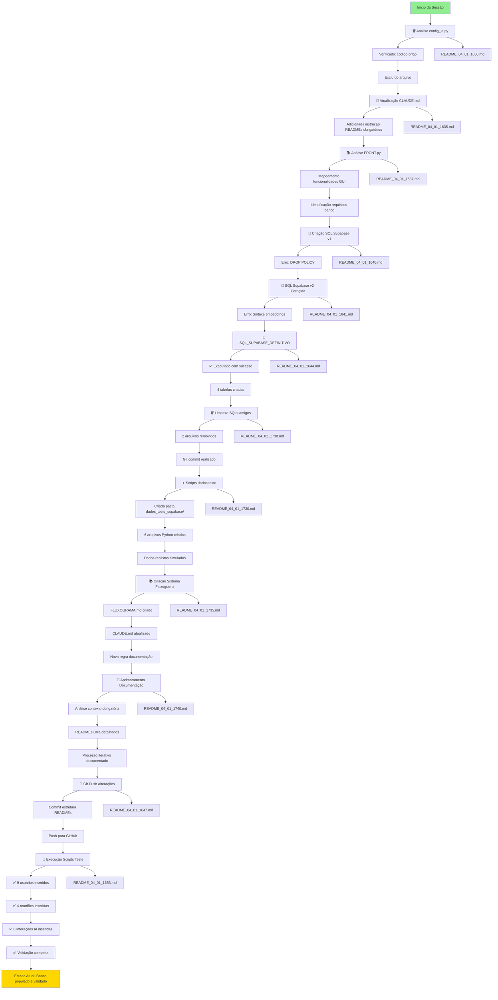

# 🔄 FLUXOGRAMA DE ALTERAÇÕES - SISTEMA AURALIS

Este arquivo mantém o histórico visual de todas as alterações realizadas no projeto. Para detalhes analíticos completos, consulte os arquivos referenciados em READMES_COMP/.

## 📊 Legenda
- 🗑️ Exclusão
- ➕ Adição
- 📝 Modificação
- 🔧 Configuração
- 📚 Documentação
- 💾 Banco de Dados
- ✅ Validação/Teste

## 🌊 Fluxo Cronológico de Alterações

## 📁 Estrutura de Arquivos Afetados

### Excluídos
- ❌ `/config_ia.py` - Código órfão sem utilização
- ❌ `/SQL_COMPLETO_SUPABASE.sql` - Versão com erros
- ❌ `/SQL_COMPLETO_SUPABASE_CORRIGIDO.sql` - Versão intermediária

### Modificados
- 📝 `/CLAUDE.md` - Adicionadas instruções de documentação obrigatória
- 📝 `/docs/01 - compact.md` - Será atualizado com sumário

### Criados
- ✅ `/SQL_SUPABASE_DEFINITIVO.sql` - Script funcional do banco
- ✅ `/dados_teste_supabase/` - Pasta com scripts de teste
  - `01_inserir_usuarios.py`
  - `02_inserir_reunioes.py`
  - `03_inserir_interacoes_ia.py`
  - `04_testar_conexao.py`
  - `executar_todos.sh`
  - `README.md`

## 🔗 Referências Detalhadas

Para análise completa de cada alteração, consulte:

| Ação | Arquivo de Referência | Descrição |
|------|----------------------|-----------|
| Exclusão config_ia.py | [README_04_01_1630.md](READMES_COMP/README_04_01_1630.md) | Análise e remoção de código órfão |
| Atualização CLAUDE.md | [README_04_01_1635.md](READMES_COMP/README_04_01_1635.md) | Implementação de documentação obrigatória |
| Análise FRONT.py | [README_04_01_1637.md](READMES_COMP/README_04_01_1637.md) | Mapeamento para estrutura de banco |
| SQL v1 (erro) | [README_04_01_1640.md](READMES_COMP/README_04_01_1640.md) | Primeira tentativa com erros |
| SQL v2 (erro) | [README_04_01_1641.md](READMES_COMP/README_04_01_1641.md) | Correção parcial |
| SQL Definitivo | [README_04_01_1644.md](READMES_COMP/README_04_01_1644.md) | Versão funcional completa |
| Limpeza e Dados Teste | [README_04_01_1730.md](READMES_COMP/README_04_01_1730.md) | Remoção SQLs antigos e criação scripts |
| Sistema Fluxograma | [README_04_01_1735.md](READMES_COMP/README_04_01_1735.md) | Criação do sistema de documentação em camadas |
| Aprimoramento Docs | [README_04_01_1740.md](READMES_COMP/README_04_01_1740.md) | Documentação ultra-detalhada e contexto obrigatório |
| Git Push Alterações | [README_04_01_1647.md](READMES_COMP/README_04_01_1647.md) | Commit e push estrutura READMEs ultra-detalhados |
| Execução Scripts Teste | [README_04_01_1653.md](READMES_COMP/README_04_01_1653.md) | População e validação completa do banco Supabase |

## 📈 Estatísticas do Projeto

- **Total de alterações**: 12 principais
- **Arquivos criados**: 11 (incluindo FLUXOGRAMA.md)
- **Arquivos excluídos**: 3
- **Arquivos modificados**: 4 (CLAUDE.md modificado 3x)
- **Linhas de código SQL**: 335 (versão final)
- **Scripts Python criados**: 6
- **READMEs documentados**: 12
- **Sistema de documentação**: 2 camadas + contexto obrigatório
- **Qualidade documentação**: Ultra-detalhada implementada
- **Dados inseridos no banco**: 21 registros (9 usuários, 4 reuniões, 8 interações IA)
- **Validação banco**: ✅ Completa e funcional

## 🎯 Próxima Atualização

Este fluxograma será atualizado automaticamente após cada interação, adicionando novos nós ao fluxo e referências aos READMEs correspondentes.

### Modificados
- 📝 `/CLAUDE.md` - Instruções de documentação + contexto obrigatório + templates detalhados
- 📝 `/docs/01 - compact.md` - Será atualizado com sumário
- 📝 `/FLUXOGRAMA.md` - Este arquivo (auto-referência)

---
*Última atualização: 04/01/2025 16:53*