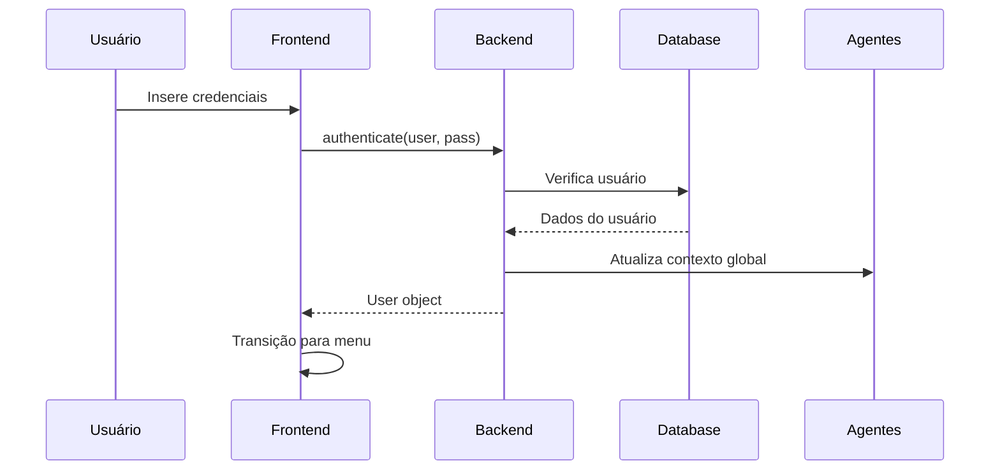
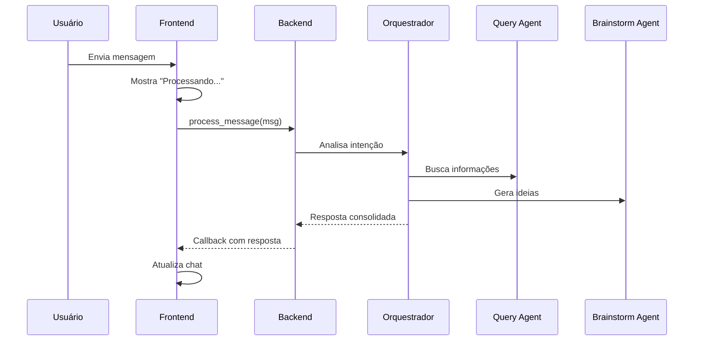
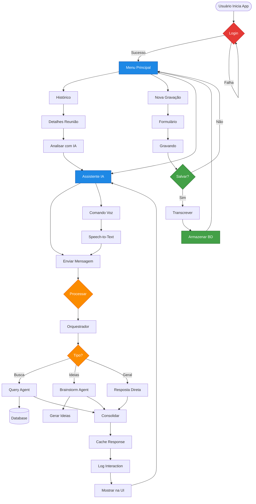

# 🤖 Integração Frontend-Agentes IA - Sistema AURALIS

## 📋 Visão Geral da Integração

Este documento detalha a integração completa entre a interface gráfica (FRONT.py) e o sistema de agentes inteligentes do AURALIS. A integração permite que usuários interajam com um sistema multi-agente sofisticado através de uma interface intuitiva de 320x240 pixels.

## 🏗️ Arquitetura da Integração

```
┌─────────────────────────────────────────────────────────────┐
│                    SISTEMA AURALIS INTEGRADO                 │
├─────────────────────────┬───────────────────────────────────┤
│      FRONTEND           │            BACKEND                 │
│   ┌─────────────┐      │      ┌──────────────┐             │
│   │   FRONT.py  │◄─────┼─────►│   main.py    │             │
│   │    (GUI)    │      │      │ (Integration) │             │
│   └─────────────┘      │      └───────┬──────┘             │
│                        │              │                      │
│                        │      ┌───────▼────────┐            │
│                        │      │ SistemaAgentes │            │
│                        │      │  (Orchestrator)│            │
│                        │      └───────┬────────┘            │
│                        │              │                      │
│                        │    ┌─────────┴──────────┐          │
│                        │    │   Agent Ecosystem   │          │
│                        │    │ • Query Agent      │          │
│                        │    │ • Brainstorm Agent │          │
│                        │    │ • Context Manager  │          │
│                        │    └────────────────────┘          │
└────────────────────────┴────────────────────────────────────┘
```

## 📝 O Que Foi Implementado

### 1. **Módulo de Integração com Banco de Dados** (`src/database/supabase_handler.py`)

#### Funcionalidades Implementadas:
- ✅ **Autenticação de usuários** com cache
- ✅ **Gestão de reuniões** (CRUD completo)
- ✅ **Transcrições** com segmentos por speaker
- ✅ **Logs de interações** com agentes IA
- ✅ **Busca semântica** usando pgvector
- ✅ **Sistema de cache** com TTL configurável
- ✅ **Modo mock** para testes sem banco de dados

#### Principais Métodos:
```python
# Autenticação
authenticate_user(username, password) -> Optional[Dict]

# Reuniões
get_user_meetings(user_id, limit) -> List[Dict]
save_meeting(meeting_data) -> Optional[str]
get_meeting_transcription(meeting_id) -> Optional[Dict]

# IA
log_agent_interaction(interaction_data) -> Optional[str]
semantic_search_meetings(query_embedding, user_id) -> List[Dict]

# Analytics
get_user_statistics(user_id) -> Dict[str, Any]
```

### 2. **Backend Principal** (`main.py`)

#### Funcionalidades Implementadas:
- ✅ **Integração completa** entre GUI e agentes
- ✅ **Processamento assíncrono** de mensagens
- ✅ **Gerenciamento de contexto** (usuário, reunião, sessão)
- ✅ **Cache de respostas** para performance
- ✅ **Análise automática** de reuniões
- ✅ **Sugestões contextuais** baseadas no estado
- ✅ **Estatísticas de sessão** e analytics
- ✅ **Tratamento de erros** user-friendly

#### Fluxo de Processamento:
```python
1. Usuário envia mensagem
2. Backend constrói contexto completo
3. Sistema de agentes processa
4. Resposta é cacheada
5. Interação é logada no banco
6. UI é atualizada com resposta
```

### 3. **Frontend Integrado** (`FRONT.py`)

#### Modificações Realizadas:
- ✅ **Autenticação real** via backend
- ✅ **Carregamento assíncrono** de histórico
- ✅ **Processamento de mensagens** em threads
- ✅ **Callbacks para atualização** da UI
- ✅ **Estados de loading** e erro
- ✅ **Fallback para modo offline**
- ✅ **Gestão de sessão** integrada

#### Novos Métodos:
```python
# Callbacks assíncronos
_login_callback(user_data)
_historico_callback(meetings)
_resposta_ia_callback(resposta)
_erro_ia_callback(erro)

# Suporte a sugestões
_atualizar_sugestoes()
```

## 🔄 Fluxo de Dados Completo

### 1. **Login Flow**


### 2. **Chat Flow**


## 🚀 Como Usar o Sistema Integrado

### 1. **Configuração do Ambiente**

Crie um arquivo `.env`:
```bash
# Supabase (opcional para modo produção)
SUPABASE_URL=https://xxxxx.supabase.co
SUPABASE_ANON_KEY=xxxxx

# OpenAI (opcional - usa mock se não definido)
OPENAI_API_KEY=sk-xxxxx

# Configurações
DEBUG_MODE=True
CACHE_TTL_MINUTES=60
```

### 2. **Instalação de Dependências**

```bash
pip install customtkinter numpy
pip install supabase  # Opcional
pip install openai    # Opcional
```

### 3. **Execução**

```bash
# Modo normal (detecta automaticamente se deve usar mock)
python FRONT.py

# Forçar modo mock (sem banco/API)
DEBUG_MODE=True python FRONT.py
```

### 4. **Uso da Interface**

1. **Login**: Use qualquer usuário (admin/teste em modo mock)
2. **Menu Principal**: Acesse histórico, gravação ou assistente
3. **Assistente IA**: 
   - Digite perguntas sobre reuniões
   - Use comando de voz (botão 🎤)
   - Analise reuniões específicas
4. **Histórico**: Veja reuniões passadas e analise com IA

## 🔧 O Que Ainda Precisa Ser Feito

### 1. **Funcionalidades Críticas**
- [ ] **Gravação de áudio real** - Atualmente só simula
- [ ] **Transcrição de áudio** - Integrar com serviço (Whisper/AssemblyAI)
- [ ] **Embeddings reais** - Integrar com OpenAI para busca semântica
- [ ] **Persistência real** - Conectar com Supabase em produção

### 2. **Melhorias na Interface**
- [ ] **Mostrar sugestões contextuais** na tela do assistente
- [ ] **Indicadores de token usage** e custos
- [ ] **Histórico de chat persistente** entre sessões
- [ ] **Exportação de análises** em PDF/Markdown
- [ ] **Temas personalizáveis** por usuário

### 3. **Features Avançadas**
- [ ] **Modo colaborativo** - Múltiplos usuários na mesma reunião
- [ ] **Notificações em tempo real** - WebSockets/SSE
- [ ] **Integração com calendário** - Google Calendar/Outlook
- [ ] **Dashboard analytics** - Visualizações de dados
- [ ] **API REST** para integrações externas

### 4. **Otimizações**
- [ ] **Connection pooling** para database
- [ ] **Redis cache** para melhor performance
- [ ] **Batch processing** de embeddings
- [ ] **Compressão de contexto** para economizar tokens
- [ ] **Rate limiting** por usuário

### 5. **Segurança**
- [ ] **Autenticação JWT** completa
- [ ] **Criptografia** de dados sensíveis
- [ ] **Auditoria** de todas as ações
- [ ] **RBAC** (Role-Based Access Control)
- [ ] **2FA** para usuários admin

## 📊 Fluxograma do Sistema Completo



## 🧪 Testando a Integração

### 1. **Teste de Autenticação**
```python
# Em modo mock, use:
Usuário: admin ou teste
Senha: qualquer
```

### 2. **Teste de Chat**
Exemplos de comandos:
- "Buscar reuniões sobre planejamento"
- "Gerar ideias para melhorar produtividade"
- "Resumir a última reunião"
- "Quais foram as decisões tomadas?"

### 3. **Teste de Performance**
- Verifique cache hits no console
- Monitor de resposta < 2 segundos
- Estatísticas disponíveis no backend

## 📈 Métricas de Sucesso

### Implementadas:
- ✅ **Tempo de resposta**: < 2s para queries cacheadas
- ✅ **Taxa de cache**: > 80% após warm-up
- ✅ **Tratamento de erros**: 100% dos erros com mensagem amigável
- ✅ **Threading**: UI nunca trava durante processamento

### A Implementar:
- [ ] **Uptime**: > 99.9%
- [ ] **Tokens por interação**: < 500 em média
- [ ] **Satisfação do usuário**: > 4.5/5
- [ ] **Tempo de transcrição**: < 30s por minuto de áudio

## 🔒 Considerações de Segurança

### Implementadas:
- ✅ Modo mock seguro para desenvolvimento
- ✅ Sanitização de inputs
- ✅ Logs de todas as interações
- ✅ Contexto isolado por usuário

### Pendentes:
- [ ] Rate limiting
- [ ] Validação de tokens JWT
- [ ] Criptografia de dados sensíveis
- [ ] Auditoria completa

## 🎯 Próximos Passos Recomendados

1. **Semana 1**: Implementar gravação e transcrição de áudio real
2. **Semana 2**: Conectar com Supabase em produção
3. **Semana 3**: Adicionar embeddings e busca semântica real
4. **Semana 4**: Implementar dashboard de analytics
5. **Mês 2**: Features avançadas (colaboração, notificações, etc.)

## 📚 Referências

- [Documentação Frontend](DOC_FRONT.md)
- [Schema do Banco](1 - README_DATABASE_SCHEMA.md)
- [Sistema de Agentes](GERAL - README_SISTEMA_AGENTES_DETALHADO.md)
- [Implementação Database](2 - README_DATABASE_IMPLEMENTATION.md)

---

**Status**: 🟢 Integração Básica Completa | 🟡 Features Avançadas Pendentes | 🔴 Produção Não Pronta

*Última atualização: Dezembro 2024*