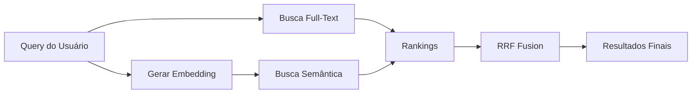

# Guia Completo: Busca Híbrida RAG com Supabase

## Índice
1. [O que é Busca Híbrida?](#o-que-é-busca-híbrida)
2. [Por que usar Busca Híbrida?](#por-que-usar-busca-híbrida)
3. [Como funciona?](#como-funciona)
4. [Configuração no Supabase](#configuração-no-supabase)
5. [Implementação Python](#implementação-python)
6. [Testando o Sistema](#testando-o-sistema)
7. [Análise de Eficiência](#análise-de-eficiência)
8. [Melhores Práticas](#melhores-práticas)

## O que é Busca Híbrida?

A busca híbrida é uma técnica avançada que combina dois métodos de busca complementares:

1. **Busca Full-Text (Palavras-chave)**: Encontra documentos que contêm palavras específicas
2. **Busca Semântica (Significado)**: Encontra documentos com significado similar, mesmo sem palavras exatas

Esta combinação oferece o melhor dos dois mundos: a precisão das palavras-chave com a compreensão contextual da busca semântica.

## Por que usar Busca Híbrida?

### Vantagens sobre métodos tradicionais:

| Método | Quando funciona bem | Limitações |
|--------|-------------------|------------|
| **Full-Text apenas** | Termos técnicos exatos, códigos, nomes próprios | Não entende sinônimos ou contexto |
| **Semântica apenas** | Perguntas naturais, conceitos abstratos | Pode perder termos exatos importantes |
| **Híbrida** | Todos os cenários acima | Mais complexa, mas muito mais eficaz |

### Casos de uso ideais:
- 📚 Bases de conhecimento
- 🔍 Motores de busca internos
- 🤖 Chatbots com RAG
- 📖 Documentação técnica
- 🛒 E-commerce (busca de produtos)

## Como funciona?

### 1. Algoritmo RRF (Reciprocal Ranked Fusion)

O coração da busca híbrida é o algoritmo RRF, que combina rankings de diferentes métodos:

```
Score RRF = 1 / (k + rank)
```

Onde:
- `k` = constante de suavização (padrão: 50)
- `rank` = posição do resultado em cada método

### 2. Processo de busca:



### 3. Pesos personalizáveis:

Você pode ajustar a importância de cada método:
- `full_text_weight`: Peso para busca por palavras (padrão: 1.0)
- `semantic_weight`: Peso para busca semântica (padrão: 1.0)

## Configuração no Supabase

### Passo 1: Criar projeto no Supabase

1. Acesse [supabase.com](https://supabase.com)
2. Crie um novo projeto
3. Anote sua URL e chave anônima

### Passo 2: Executar SQL de configuração

No SQL Editor do Supabase, execute o arquivo `supabase_hybrid_search_setup.sql` que criamos:

```sql
-- Este arquivo contém:
-- 1. Habilitação da extensão pgvector
-- 2. Criação da tabela documents
-- 3. Índices otimizados
-- 4. Função hybrid_search
-- 5. Funções auxiliares
```

### Passo 3: Verificar instalação

Execute este SQL para verificar:

```sql
-- Verificar se as extensões foram instaladas
SELECT * FROM pg_extension WHERE extname = 'vector';

-- Verificar se a tabela foi criada
SELECT column_name, data_type 
FROM information_schema.columns 
WHERE table_name = 'documents';

-- Verificar se a função existe
SELECT routine_name 
FROM information_schema.routines 
WHERE routine_name = 'hybrid_search';
```

## Implementação Python

### 1. Instalar dependências:

```bash
pip install supabase openai python-dotenv numpy
```

### 2. Configurar variáveis de ambiente:

Crie um arquivo `.env`:

```env
OPENAI_API_KEY=sua_chave_aqui
SUPABASE_URL=https://seu-projeto.supabase.co
SUPABASE_KEY=sua_chave_anonima_aqui
```

### 3. Usar a classe HybridSearchRAG:

```python
from hybrid_search_rag_test import HybridSearchRAG

# Inicializar
rag = HybridSearchRAG(
    supabase_url=SUPABASE_URL,
    supabase_key=SUPABASE_KEY,
    openai_api_key=OPENAI_API_KEY
)

# Adicionar documento
result = rag.add_document(
    content="Conteúdo do documento",
    metadata={"categoria": "tutorial"}
)

# Buscar
results = rag.hybrid_search(
    query="sua pergunta aqui",
    match_count=5,
    full_text_weight=1.0,
    semantic_weight=1.5  # Dar mais peso à semântica
)

# Gerar resposta com RAG
response = rag.generate_rag_response(query, results)
```

## Testando o Sistema

### Teste 1: Adicionar documentos diversos

```python
# Documentos de teste com diferentes características
documentos = [
    # Técnico/específico - melhor para full-text
    {"content": "PostgreSQL versão 15.2 com extensão pgvector 0.5.1"},
    
    # Conceitual - melhor para semântica
    {"content": "Sistema que aprende padrões através de experiências"},
    
    # Misto - ideal para busca híbrida
    {"content": "Machine Learning com Python usando scikit-learn"}
]
```

### Teste 2: Queries com diferentes pesos

```python
# Query técnica - aumentar peso full-text
results = rag.hybrid_search(
    "PostgreSQL pgvector",
    full_text_weight=2.0,
    semantic_weight=0.5
)

# Query conceitual - aumentar peso semântico
results = rag.hybrid_search(
    "como sistemas aprendem sozinhos?",
    full_text_weight=0.5,
    semantic_weight=2.0
)
```

### Teste 3: Análise de performance

```python
perf = rag.analyze_search_performance("sua query")
print(perf["summary"])
```

## Análise de Eficiência

### Comparação de Métodos

| Aspecto | Full-Text | Semântica | Híbrida |
|---------|-----------|-----------|----------|
| **Velocidade** | ⚡⚡⚡⚡⚡ | ⚡⚡⚡ | ⚡⚡⚡⚡ |
| **Precisão exata** | ⭐⭐⭐⭐⭐ | ⭐⭐ | ⭐⭐⭐⭐ |
| **Compreensão contextual** | ⭐ | ⭐⭐⭐⭐⭐ | ⭐⭐⭐⭐⭐ |
| **Robustez a erros** | ⭐ | ⭐⭐⭐⭐ | ⭐⭐⭐⭐ |
| **Custo computacional** | $ | $$$ | $$ |

### Quando cada método é mais eficiente:

1. **Use Full-Text puro quando:**
   - Buscar códigos, IDs, referências exatas
   - Performance é crítica
   - Termos são padronizados

2. **Use Semântica pura quando:**
   - Queries são perguntas naturais
   - Conceitos abstratos
   - Múltiplas formas de expressar a mesma ideia

3. **Use Híbrida quando:**
   - Precisão E contexto são importantes
   - Base diversa de documentos
   - Experiência de usuário é prioridade

## Melhores Práticas

### 1. Otimização de Embeddings

```python
# Use dimensões menores para melhor performance
embedding = openai.embeddings.create(
    model="text-embedding-3-small",
    input=text,
    dimensions=512  # Menor que o padrão 1536
)
```

### 2. Indexação Inteligente

```sql
-- Criar índices parciais para grandes volumes
CREATE INDEX documents_recent_idx ON documents 
USING gin(fts) 
WHERE created_at > NOW() - INTERVAL '30 days';
```

### 3. Ajuste de Pesos Dinâmico

```python
def ajustar_pesos(query: str) -> tuple:
    """Ajusta pesos baseado na natureza da query"""
    # Se tem aspas, provavelmente busca exata
    if '"' in query:
        return (2.0, 0.5)
    
    # Se é pergunta, provavelmente conceitual
    if query.endswith('?'):
        return (0.5, 2.0)
    
    # Padrão balanceado
    return (1.0, 1.0)
```

### 4. Cache de Embeddings

```python
# Implementar cache para queries frequentes
from functools import lru_cache

@lru_cache(maxsize=1000)
def get_cached_embedding(text: str):
    return generate_embedding(text)
```

### 5. Monitoramento

```sql
-- Criar view para monitorar uso
CREATE VIEW search_metrics AS
SELECT 
    date_trunc('hour', created_at) as hour,
    COUNT(*) as searches,
    AVG(array_length(regexp_split_to_array(content, '\s+'), 1)) as avg_doc_words
FROM documents
GROUP BY hour;
```

## Conclusão

A busca híbrida com RAG representa o estado da arte em sistemas de recuperação de informação. Ao combinar a precisão da busca por palavras-chave com a compreensão contextual da busca semântica, oferece:

✅ **Resultados mais relevantes**: Encontra tanto correspondências exatas quanto conceituais
✅ **Flexibilidade**: Ajuste fino através de pesos personalizáveis
✅ **Escalabilidade**: Otimizada com índices apropriados
✅ **Experiência superior**: Usuários encontram o que procuram, independente de como perguntam

### Próximos Passos

1. **Configurar Supabase**: Execute o SQL fornecido
2. **Testar com seus dados**: Use o script Python
3. **Ajustar pesos**: Baseado em seus casos de uso
4. **Monitorar performance**: Use as funções de análise
5. **Iterar e melhorar**: Ajuste conforme feedback

### Recursos Adicionais

- [Documentação Supabase Vector](https://supabase.com/docs/guides/ai)
- [pgvector GitHub](https://github.com/pgvector/pgvector)
- [OpenAI Embeddings Guide](https://platform.openai.com/docs/guides/embeddings)

---

**Nota**: Este sistema foi projetado para demonstrar as capacidades da busca híbrida. Para produção, considere adicionar autenticação robusta, rate limiting, e monitoramento detalhado.